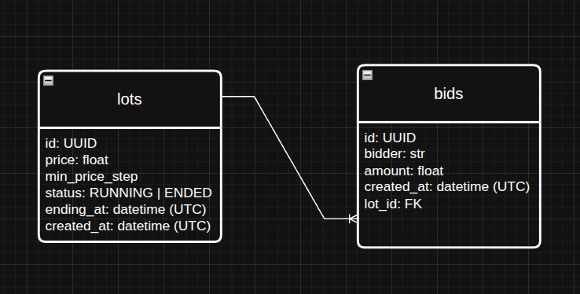

# Real-time auction platform built for demonstration purposes

*I deployed .envs on purpose*

## How to run

---

```bash
git clone https://github.com/usrofgh/lottoland.git
cd lottoland
```

Run on Linux from the root directory:
```bash
make up
```

Run on Windows from the root directory:
```
docker compose --env-file envs/.env.dev -f docker/docker-compose-base.yml -f docker/docker-compose-dev.yml up --build
```

## Stack

---
* FastAPI
* PostgreSQL
* Alembic
* Pydantic
* Redis
* Ruff
* uv
* dishka (IoC container)


---

## Architecture & patterns
* Clean Architecture
* DDD
* Repository
* CQRS
* IoC

---

### Relations


---
